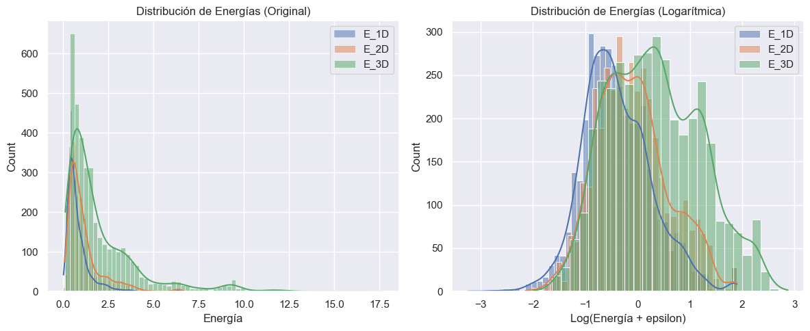

# GNN-based Screening of Lithium Materials for Solid-State Batteries

Este repositorio contiene el proyecto desarrollado para un TFM cuyo objetivo es diseñar un **workflow de cribado de materiales con litio** para identificar candidatos con **baja energía de activación** y, por tanto, potencialmente buenos difusores iónicos para baterías de estado sólido.

La idea central es usar una **Graph Neural Network (GNN)** como *surrogate model* barato para predecir energías de activación y reservar **MACE** para la validación más precisa de un conjunto mucho más pequeño de materiales candidatos.

> El repositorio ha completado su fase de desarrollo principal. Ahora incluye el flujo de **screening automático**, permitiendo pasar de miles de materiales a los **10 mejores** candidatos de forma totalmente automatizada.

---

## Motivación científica

En materiales para difusión iónica, el cuello de botella no es solo encontrar compuestos con litio, sino reducir un espacio químico muy grande a un conjunto pequeño de materiales prometedores. Los cálculos atomísticos de alta fidelidad, como los realizados con MACE, son demasiado costosos para explorar miles de candidatos de manera directa.

La estrategia del proyecto es jerárquica:

1. **Materials Project** para extraer estructuras cristalinas candidatas con litio.
2. **BVEL13k** para obtener las energías de activación supervisadas.
3. **GNN** para predecir rápidamente la energía de activación.
4. **MACE** para refinar o validar solo los materiales mejor puntuados.

---

## Flujo general del proyecto

```text
Materials Project
      ↓
Extracción de estructuras con Li
      ↓
Generación de carpetas POSCAR + metadata.json
      ↓
Cruce con BVEL13k
      ↓
Asignación de labels E_1D, E_2D, E_3D
      ↓
Construcción de grafos cristalinos
      ↓
Normalización / partición train-val-test
      ↓
Entrenamiento de la GNN
      ↓
Predicción de energía de activación
      ↓
Ranking automático de candidatos
      ↓
Evaluación con MACE
```

---

## Estructura del repositorio

```text
.
├── MACE/
│   ├── npt.py
│   ├── mace-mpa-0-medium.model
│   └── plot-convergence.ipynb
├── libraries/
│   ├── dataset.py
│   ├── graph.py
│   ├── model.py
│   ├── screen_candidates.py
│   ├── GCNN.py
│   ├── DGNN.py
│   ├── FDGNN.py
│   ├── FDGNN2.py
│   ├── MDGNN.py
│   ├── M3GNet.py
│   ├── dynamics.py
│   └── convergence.py
├── MP-query.ipynb
├── merge_data.py
├── run-GNN.ipynb
├── run-MACE.ipynb
├── train-GNN.ipynb
├── candidates.txt
└── requirements.txt
```

### Propósito de cada componente

- **`MP-query.ipynb`**: consulta Materials Project y genera la carpeta `input/candidates/` con `POSCAR` y `metadata.json`.
- **`merge_data.py`**: cruza los candidatos con `BVEL13k` y añade `E_1D`, `E_2D` y `E_3D` a los metadatos.
- **`libraries/graph.py`**: convierte una estructura cristalina en un grafo.
- **`libraries/dataset.py`**: construye, normaliza y guarda datasets en formato PyTorch Geometric.
- **`libraries/model.py`**: utilidades de entrenamiento, evaluación y carga de modelos.
- **`libraries/screen_candidates.py`**: lógica de inferencia, ranking ponderado y exportación.
- **`train-GNN.ipynb`**: entrenamiento de la red para predecir energía de activación.
- **`run-GNN.ipynb`**: interfaz para ejecutar el screening sobre el dataset completo.
- **`MACE/npt.py`**: ejecuta simulaciones NPT con MACE sobre materiales seleccionados.
- **`run-MACE.ipynb`**: lanza simulaciones MACE sobre los materiales en `candidates.txt`.
- **`MACE/plot-convergence.ipynb`**: analiza convergencia y difusión a partir de la trayectoria.

---

## Fuentes de datos

### Materials Project

Se usa para obtener estructuras cristalinas con litio y metadatos estructurales y termodinámicos.

Los campos solicitados en la consulta incluyen, entre otros:

- `material_id`
- `formula_pretty`
- `structure`
- `elements`
- `nelements`
- `volume`
- `density`
- `energy_above_hull`
- `formation_energy_per_atom`
- `band_gap`
- `is_stable`
- `symmetry`

### BVEL13k

Se usa como fuente de labels de difusión / energía de activación.

El cruce con esta base de datos añade:

- `E_1D`
- `E_2D`
- `E_3D`

---

## Transformación de datos: de base de datos a entrada de la GNN

Esta es la parte central del proyecto. El dato pasa por varias representaciones hasta convertirse en un grafo entrenable.

### 1) Extracción desde Materials Project

El notebook `MP-query.ipynb` consulta Materials Project filtrando materiales que contienen litio.

Para cada documento devuelto se crea una carpeta con esta estructura:

```text
input/candidates/<formula>/<symmetry>/
├── POSCAR
└── metadata.json
```

### Ejemplo de carpeta de material

```text
input/candidates/Li7La3Zr2O12/Ia-3d/
├── POSCAR
└── metadata.json
```

### Ejemplo de `metadata.json` tras la consulta

```json
{
  "material_id": "mp-XXXXX",
  "formula": "Li7La3Zr2O12",
  "symmetry": "Ia-3d",
  "elements": ["Li", "La", "Zr", "O"],
  "nelements": 4,
  "volume": 1234.56,
  "density": 5.21,
  "energy_above_hull": 0.012,
  "formation_energy_per_atom": -6.84,
  "band_gap": 5.10,
  "is_stable": true
}
```

> Los valores numéricos anteriores son un ejemplo ilustrativo del formato; el script guarda exactamente esos campos, pero los valores dependen del material descargado.

---

### 2) Cruce con BVEL13k

El script `merge_data.py` lee `datasets/BVEL13k/BVEL13k_index.csv` y cruza cada `material_id` con las energías de activación disponibles.

Si el material existe en BVEL13k, el `metadata.json` se amplía con:

```json
{
  "E_1D": 0.38,
  "E_2D": 0.62,
  "E_3D": 0.91
}
```

Si no existe, la carpeta del candidato se elimina para evitar samples sin etiqueta.

En otras palabras, el flujo real es:

```text
Materials Project candidate
      ↓
material_id
      ↓
match con BVEL13k_index.csv
      ↓
labels de difusión añadidas al metadata.json
```

---

### 3) Lectura de la estructura cristalina

`libraries/dataset.py` carga el fichero `POSCAR` usando `pymatgen`:

```python
structure = Poscar.from_file(poscar_path).structure
```

En este punto, el material ya no se maneja como un simple fichero POSCAR, sino como un objeto `Structure` con:

- celda unitaria,
- posiciones fraccionarias,
- especies atómicas,
- simetría cristalina.

---

### 4) Conversión de la estructura en grafo

`libraries/graph.py` transforma la estructura cristalina en un grafo con:

- **nodos** = átomos,
- **aristas** = vecindades geométricas / relaciones cristalinas,
- **atributos de nodo** = propiedades atómicas,
- **atributos de arista** = distancias o pesos geométricos.

Las features de cada nodo incluyen:

- masa atómica,
- carga,
- electronegatividad,
- energía de ionización,
- radio iónico estimado.

El grafo se construye usando una de estas codificaciones:

- `voronoi`
- `sphere-images`
- `all-linked`
- `molecule`

En el proyecto, la codificación por defecto usada para el dataset es `sphere-images`.

### Ejemplo conceptual del grafo de un material

Para un material como `Li7La3Zr2O12`:

- número de nodos = número total de átomos en la estructura,
- cada nodo contiene un vector de features atómicas,
- cada arista contiene la distancia entre dos átomos vecinos.

Ejemplo esquemático:

```text
Nodos:
  Li  → [masa, carga, electronegatividad, ionización, radio iónico]
  La  → [masa, carga, electronegatividad, ionización, radio iónico]
  Zr  → [masa, carga, electronegatividad, ionización, radio iónico]
  O   → [masa, carga, electronegatividad, ionización, radio iónico]

Aristas:
  (i, j) → distancia interatómica
```

---

### 5) Construcción del dataset PyTorch Geometric

Una vez creado el grafo, `libraries/dataset.py` lo empaqueta en un objeto `Data` de PyTorch Geometric:

```python
Data(
    x=nodes,
    edge_index=edges.t().contiguous(),
    edge_attr=attributes.ravel(),
    y=torch.tensor([E_1D, E_2D, E_3D]),
    label="<material> <polymorph>"
)
```

### Interpretación de cada campo

- `x`: matriz de features de nodo, de tamaño `[n_atoms, n_features]`.
- `edge_index`: conectividad del grafo, de tamaño `[2, n_edges]`.
- `edge_attr`: atributos de arista, normalmente distancias.
- `y`: vector target con las energías de activación.
- `label`: identificador único del sample.

### Ejemplo esquemático para un material concreto

```text
Data(
  x=[96, 5],
  edge_index=[2, 812],
  edge_attr=[812],
  y=[3],
  label='Li7La3Zr2O12 Ia-3d'
)
```

En este ejemplo:

- hay 96 átomos en la celda/grupo tratado,
- cada átomo tiene 5 features,
- existen 812 relaciones geométricas,
- y el target contiene `E_1D`, `E_2D` y `E_3D`.

---

## Normalización y partición del dataset

`libraries/dataset.py` también realiza:

- filtrado de valores no finitos,
- normalización de `x`, `edge_attr` y `y`,
- partición en train / validation / test.

La función `standardize_dataset()` calcula estadísticas globales:

- media y desviación estándar de las features de nodo,
- media y desviación estándar de las aristas,
- media y desviación estándar de los targets (tras la transformación logarítmica).

### Transformación Logarítmica de los Targets

Dado que las energías de activación pueden variar significativamente entre órdenes de magnitud, el proyecto aplica un **cambio de variable** antes de la estandarización:

$$
y_{log} = \ln(y + \epsilon)
$$

Donde $\epsilon$ (por defecto $10^{-6}$) evita problemas de indeterminación. Esta transformación:

- Comprime el rango dinámico de las energías.
- Ayuda a la GNN a aprender mejor las diferencias en materiales con baja energía (los más interesantes para el cribado).
- Mejora drásticamente la estabilidad numérica durante el entrenamiento.



Durante la fase de **Candidate Screening**, el modelo predice valores en este espacio logarítmico. El sistema aplica automáticamente la **transformación inversa** ($e^{y_{log}} - \epsilon$) antes de generar los informes finales, asegurando que el usuario trabaje siempre con unidades físicas reales (eV).

---

## Modelos GNN incluidos

El repositorio contiene varias arquitecturas experimentales evaluadas durante el proyecto:

- **GCNN (Graph Convolutional Neural Network)**: El baseline de convolución. Ha demostrado ser el **segundo mejor modelo** en términos de precisión de predicción, con una excelente relación entre velocidad y resultados.
- **FDGNN (Fast Diffusion GNN)**: Una versión simplificada de la arquitectura DGNN. Es el modelo que ha dado **mejores resultados** (superando a GCNN), aunque su tiempo de entrenamiento es considerablemente mayor.
- **FDGNN2**: Segunda variante experimental de la arquitectura FDGNN.
- **DGNN (Diffusion GNN)**: Una arquitectura más compleja que resultó ser **demasiado costosa** computacionalmente para el volumen de datos del proyecto.
- **MDGNN (Multimodal DGNN)**: Un híbrido entre GCNN y DGNN que, al igual que su predecesor, resultó ser **excesivamente costoso** de entrenar.
- **M3GNet**: Se intentó integrar este modelo pre-entrenado, pero **no ha funcionado** en el entorno actual debido a discrepancias de versiones con la librería `matgl`.

La selección del modelo se gestiona desde `libraries/model.py`.

---

## Entrenamiento de la GNN

El notebook `train-GNN.ipynb` define:

- número de épocas,
- batch size,
- learning rate,
- dropout,
- optimizer,
- loss function,
- partición train/val/test,
- número de targets (`E_3D` o multitarget).

El entrenamiento está pensado para dos configuraciones principales:

### Modo 1: `3d`

Solo se predice `E_3D`.

### Modo 2: `multitarget`

Se predicen simultáneamente:

- `E_1D`
- `E_2D`
- `E_3D`

Durante el entrenamiento se guardan:

- curvas de aprendizaje,
- predicciones,
- comparaciones computed vs predicted,
- checkpoints del modelo.

---

## Candidate Screening

El proceso de cribado automatizado permite realizar inferencias sobre grandes bases de datos para identificar materiales con baja barrera de activación. El proceso sigue estos pasos:

1. **Inferencia**: El modelo entrenado procesa los grafos de materiales no etiquetados.
2. **Ranking**: Se calculan las energías de activación y se ordenan de menor a mayor.
3. **Exportación**: Los materiales con mejor desempeño energético se exportan automáticamente a `candidates.txt` para su posterior validación de alta fidelidad.

---

## Integración con MACE

MACE se usa como una etapa posterior de validación más costosa.

### `MACE/npt.py`

Este script:

- lee `candidates.txt`,
- busca la estructura POSCAR de cada material,
- construye un supercell si hace falta,
- carga el modelo MACE,
- corre una dinámica NPT,
- guarda trayectoria, log y estructura final.

### `run-MACE.ipynb`

Lanza la simulación para un material concreto, por ejemplo:

```text
BaLiF3
```

### `MACE/plot-convergence.ipynb`

Analiza la trayectoria generada y calcula:

- convergencia de temperatura,
- presión,
- volumen,
- difusión,
- conductividad iónica.

---

## Estado actual del proyecto

El pipeline está diseñado en dos niveles:

### Implementado

- Extracción de candidatos desde Materials Project.
- Construcción de metadata y cruce con BVEL13k.
- Creación de grafos cristalinos y datasets estandarizados.
- Entrenamiento de múltiples arquitecturas GNN (FDGNN, GCNN, etc.).
- **Pipeline de Inferencia y Screening** (Inferencia → Ranking → Exportación).
- Ejecución automatizada de MACE para candidatos seleccionados.
- Análisis de convergencia y difusión post-MACE.

---

## Requisitos

Las dependencias se listan en `requirements.txt`.

Entre ellas:

- `torch`
- `torch_geometric`
- `pymatgen`
- `ase`
- `mace-torch`
- `matgl`
- `dgl`
- `rdkit`
- `mp-api`
- `scikit-learn`
- `pandas`
- `numpy`

---

## Instalación

```bash
pip install -r requirements.txt
```

Si trabajas en Colab, los notebooks ya incluyen la instalación de dependencias.

---

## Uso

### 1. Descargar candidatos desde Materials Project

Ejecutar `MP-query.ipynb`.

### 2. Cruzar candidatos con BVEL13k

Ejecutar `merge_data.py`.

### 3. Construir y entrenar el modelo

Ejecutar `train-GNN.ipynb`.

### 4. Ejecutar el Screening automático

Configurar el modelo deseado en `run-GNN.ipynb` y ejecutarlo para generar `candidates.txt`.

### 5. Validar materiales con MACE

Ejecutar `run-MACE.ipynb` o `MACE/npt.py` para procesar los candidatos seleccionados.

---

## Nota sobre los datos no versionados

Las carpetas de datos no se incluyen en el repositorio para evitar que el tamaño del proyecto sea excesivo. El código asume que existen, al menos, estas rutas:

```text
input/candidates/
datasets/BVEL13k/
MACE/results/
```

---

## Referencias

- Materials Project
- BVEL13k
- PyTorch Geometric
- MACE
- pymatgen
- ASE
